<table style="width: 100%;">
  <tr>
    <td style="text-align: center; border: none;"> 
    Минестерство образования и науки РФ <br>
    ГБПОУ РМЭ "Йошкар-Олинский Технологический колледж </td>
  </tr>
  <tr>
    <td style="text-align: center; border: none; height: 15em;"><h2> Курсовая работа</h2><br>
    По теме: "Аптека"
    </td>
  </tr>
  <tr>
    <td style="text-align: right; border: none; height: 20em;">
      Разработала: Шарапова Екатерина<br/>
      Группа: И-31<br/>
      Проверил: Колесников Е.И.       
    </td>
  </tr>
  <tr>
    <td style="text-align: center; border: none; height: 5em;">
    г. Йошкар-Ола, 2022</td>
  </tr>
</table>

<div style="page-break-after: always;"></div>

# Содержание 

# Описание предметной области
* [Описание предметной области](#описание-предметной-области)
* [Диаграмма прецендентов](#диаграмма-прецендентов)
* [Спецификация прецендентов](#спецификация-прецендентов)
* [ER-диаграмма](#er-диаграмма)
* [Test Cases](#test-cases)
* [Скрипт Базы Данных](#скрипт-базы-данных)
* [Проект на C#](#проект-на-с)
* [Вывод](#вывод)


Наша компания занимается исключительно продажей лекарственных средств, медикаментов и медецинского оборудования. Продажи проводятся в онлайн магазине. Доставка товара осуществляется с помощью курьерской службы. Также наши покупатели могут проконсультироваться с нашим фармацевтом. По всем вопросам можно связаться с нашим менеджером. Все номера находятся на нашем сайте.

Наша компания продает все лекарства легально, все документы можно посмотреть онлайн на нашем сайте. Также имеется разрешение на дистанционную торговлю. Наша организация имеет:

•лицензию на осуществление фармацевтической деятельности (не менее года);

•не менее 10 мест осуществления фармацевтической деятельности на территории РФ;

•оборудованные помещения для хранения сформированных заказов;

•Desktop приложение;

•договор со службой курьерской доставки, которые имеют оборудование для доставки лекарственных препаратов, обеспечивающее поддержание необходимого температурного режима;

•электронную систему платежей и мобильные терминалы для проведения электронных платежей в момент доставки заказа.

Обязанности нашего менеджера:

•Контроль наличия товара на складе и своевременное пополнение запасов.

•Выбор лучших поставщиков и ценовых предложений.

•Ведение переговоров с поставщиками.

•Контроль движения грузов и сроков отгрузки товара.

•Контроль качества продукции.

Также наш менеджер предоставляет покупателю сведения об основных потребительских свойствах товара, а в момент доставки заказа – в письменной форме информацию о порядке и сроках возврата товара. Более того наши покупатели имеют свои права и обязанности. До оплаты заказа покупатель вправе отказаться от него, заплатив только за доставку. Однако уже приобретенные лекарственные препараты надлежащего качества возврату и обмену не подлежат. Доброкачественный товар покупатель сможет обменять, только если фармацевт перепутал его наименование, ошибся в дозировке или форме лекарственного средства. Кроме того, лекарства могут быть возвращены в аптеку в том случае, если они ненадлежащего качества или их продажа сопровождалась распространением недостоверной информации. Наши покупатели при получении заказа обязательно должны проверять целостность транспортной упаковки, затем ее нужно вскрыть и сверить содержимое заказа с описью вложения. Также следует проверить отсутствие повреждений упаковки лекарства и общий вид товара. При получении лекарственного препарата, который требуется хранить при определенной температуре, покупатель должен попросить курьера продемонстрировать, что условия хранения товара при доставке соответствуют указанным на упаковке. В случае доставки ошибочного заказа или некачественного лекарственного препарата покупатель вправе вернуть его курьеру без оплаты товара и доставки. Если был приобретен товар ненадлежащего качества, но наш менеджер отказывается принять его обратно или заменить на новый, то следует составить и направить ему претензию в свободной форме в двух экземплярах с просьбой вернуть или заменить товар. К претензии можно приложить лекарство или медицинское изделие, кассовый или товарный чек, рецепт врача, если товар был приобретен в аптеке по рецепту, а также при наличии гарантийный талон и показания свидетелей.

Лекарственные препараты и медицинские изделия будут считаться некачественными, если:

•на момент продажи истек срок годности;

•нет обязательной информации о товаре, в том числе на русском языке;

•не совпадают серия и срок годности на первичной и вторичной (потребительской) упаковках;

•нет инструкции по применению препарата;

•описание препарата в инструкции не соответствует фактическому цвету, запаху, форме, размеру, консистенции и иным показателям;

•обнаружен брак упаковки – сколы, негерметичность, нечитаемая полиграфия.

Говоря о акциях, людям пенсионного возраста действует скидка 15%. Также всем клиентам при каждой покупке будут начисляться баллы и можно использовать их при покупке продукции. Информацию об акциях, баллах и скидках можно узнать в онлайн формате. Кроме того, на нашем сайте клиент может написать свой отзыв о нашей компании.

# Диаграмма прецендентов
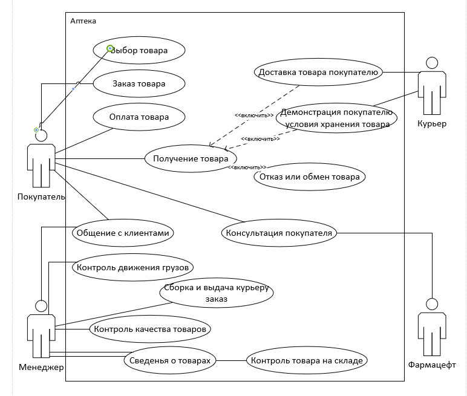

# Спецификация прецендентов

Значение | Содержание
:---:|---:
*Прецедент* |  Выбор товара
*Идентификатор* | ID 1
*Краткое описание* | Покупатель выбирает товар в аптеке
*Главное акторы* |  Покупатель
*Второстепенные акторы* | Менеджер
*Предусловия* | Покупатель выбрал товар
*Основной поток* | 1.Прецендент начинается, когда Покупатель оформляет заказ<br/>2. Менеджер принимает заказ
*Альтернативные потоки* | 2.1 Менеджер предлагает оформить заказ<br/>2.2 Менеджер предлагает проконсультироваться с фармацевтом
*Постусловия* | 1.Покупатель выбрал товар<br/>2.Покупатель отказался от покупки

Значение | Содержание
:---:|---:
*Прецедент* |  Доставка товара
*Идентификатор* | ID 2
*Краткое описание* | Курьер доставляет товар покупателю
*Главные акторы* | Курьер
*Второстепенные акторы* | Покупатель
*Предусловия* | Курьер принимает заказ для доставки  
*Основной поток* | 1.Прецендент начинается, когда Покупатель оформляет заказ <br/>2. Курьер принимает заказ
*Альтернативные потоки* | Нет
*Постусловия* | 1.Покупатель принял товар<br/>2.Покупатель отказался от товара

Значение | Содержание
:---:|---:
*Прецедент* |  Консультация покупателя
*Идентификатор* | ID 3
*Краткое описание* | Фармацевт консультирует покупателя 
*Главные акторы* | Фармацевт
*Второстепенные акторы* | Покупатель
*Предусловия* | Фармацевт принимает звонок покупателя
*Основной поток* | 1.Прецендент начинается, когда Покупатель звонит  <br/>2. Фармацевт консультирует покупателя в режиме диалога
*Альтернативные потоки* | Нет
*Постусловия* | 1.Покупатель ознакомился с товаром

Значение | Содержание
:---:|---:
*Прецедент* |  Получение товара
*Идентификатор* | ID 4
*Краткое описание* | Покупатель получает товар
*Главное акторы* |  Покупатель
*Второстепенные акторы* | Курьер
*Предусловия* | Покупатель выбрал товар
*Основной поток* | 1.Прецендент начинается, когда курьер доставил товар<br/>2. Покупатель принял товар
*Альтернативные потоки* | Нет
*Постусловия* | 1. Покупатель принял товар  <br/>2.Покупатель отказался от товара

# ER-диаграмма

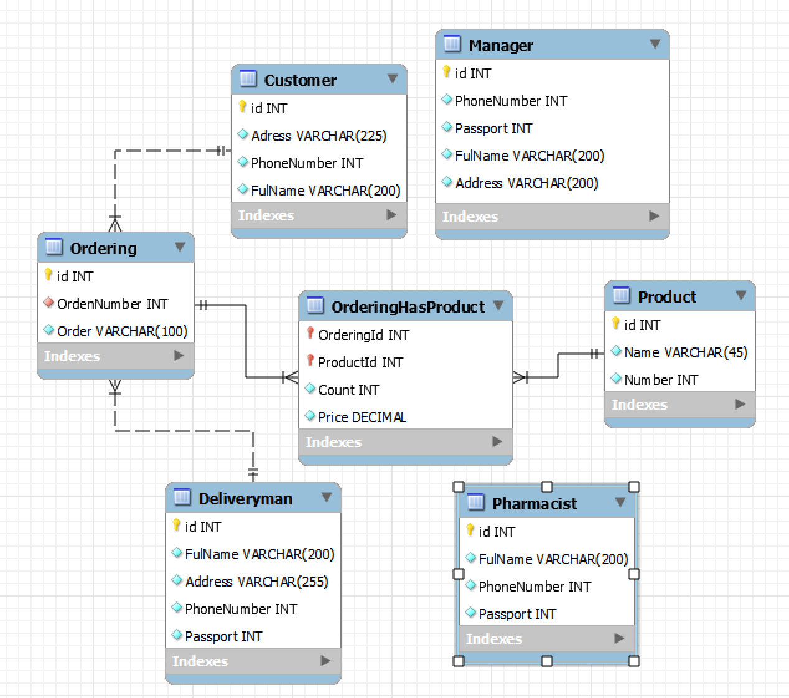

### Объекты, которые включены в ER-диаграмму

Customer - это сущность, которая хранит информацию о покупателе

Deliveryman - это сущность, которая хранит информацию о курьере

Ordering goods - это сущность, которая хранит информацию о заказах

Pharmacist - это сущность, которая хранит информацию о фармацевте

Manager - это сущность, которая хранит информацию о менеджере

Warehouse - это сущность, которая хранит информацию о складе

### Определение отношений между сущностями

Покупатель и товар

* Клиент может купить один или более товаров

* Товар может быть куплен одним или более клиентами

Покупатель и платежные организации

* Покупатель может иметь только одну учетную запись, но может сделать несколько платежей

# Test Cases

1. Тестовый пример #1:

&nbsp;|&nbsp;| Мои комментарии
---|---|---
Тестовый пример# | TC_DP_1 | Расшифровывается: TestCase_DeleteProduct_1
Приоритет тестирования| Средний | Бизнес-правило
Заголовок|Удаление товара
Краткое изложение теста | Должно произойти удаление товара
Этапы теста | 1. Добавить данные в FakeDataProvider; <br> 2. Вызывать метод удаления товара; <br> 3.Проверить наличие удаленной записи
Тестовые данные | Название: Цитрамон П; <br> Производитель: ИП Шарапова Е.А.; <br> Цена: 344 руб.; 
Ожидаемый результат: | Запись должна быть удалена
Фактический результат: | Запись удалена
Статус | Зачёт
Предварительное условие | Должен быть создан FakeDataProvider с внесенными в него записями
Постусловие | Список товаров должен уменьшиться на один
Примечания/Комментарии | Т.к. мы удаляли товар без продаж, то ошибок быть не может не по вине кода ни по ограничениям базы


2. Тестовый пример #2: 

&nbsp;|&nbsp;| Мои комментарии
---|---|---
Тестовый пример# | TC_DP_2 | Расшифровывается: TestCase_DeleteProduct_2
Приоритет тестирования | Средний | Бизнес-правило
Заголовок | Удаление товара по которому была совершена продажа
Краткое изложение теста | Удаление товара должно не произойти, так как по нему были совершены продажи
Этапы теста | 1. Добавить данные в FakeDataProvider;<br> 2.Вызвать метод удаления; <br>3. Проверить наличие удаленной записи
Тестовые данные |Название: Цитрамон П; <br> Производитель: ИП Шарапова Е.А.; <br> Цена: 344 руб.; 
Ожидаемый результат: | Запись не должна удалиться
Фактический результат: | Запись не удалилась
Статус:| Зачёт
Предварительное условие: | Должна быть создана запись товара, по которому была совершена продажа, в FakeDataProvider
Постусловие: | Список товаров должен остаться без изменений
Примечания/Комментарии | Т.к мы удаляли товар по которому была совершена продажа и удаление не произошло, то ошибок быть не может

3. Тестовый пример #3: 

&nbsp;|&nbsp;| Мои комментарии
---|---|---
Тестовый пример# | TC_DP_3 | Расшифровывается: TestCase_DeleteProduct_3
Приоритет тестирования | Средний | Бизнес-правило
Заголовок | Удаление несуществущего товара | Товара не существует в базе данных
Краткое изложение теста | Удаление товара не должно произойти, удаляемого элемента не существует
Этапы теста | 1.Вызвать метод удаления; <br>2. Проверить результат;
Тестовые данные |Название: Цитрамон П; <br> Производитель: ИП Шарапова Е.А.; <br> Цена: 344 руб.; 
Ожидаемый результат: | Запись не должна удалиться
Фактический результат: | Запись не удалилась
Статус:| Зачёт
Предварительное условие: | У удаляемого товара ID должен быть равен нулю | Товара нет в базе данных
Постусловие: | Список товаров должен остаться без изменений
Примечания/Комментарии | Т.к мы удаляли товар ID которого равен нулю, то удаление не должно произойти, следовательно ошибок быть не может.

4. Тестовый пример #4:

&nbsp;|&nbsp;| Мои комментарии
---|---|---
Тестовый пример# | TC_DP_4 | Расшифровывается: TestCase_DeleteProduct_4
Приоритет тестирования | Средний | Бизнес-правило
Заголовок|Удаление заказа
Краткое изложение теста | Должно произойти удаление заказа
Этапы теста | 1. Добавить данные в FakeDataProvider; <br> 2. Вызывать метод удаления заказа; <br> 3.Проверить наличие удаленной записи
Тестовые данные | Название: Цитрамон П; <br> Производитель: ИП Шарапова Е.А.; <br> Цена: 344 руб.; 
Ожидаемый результат: | Запись должна быть удалена
Фактический результат: | Запись удалена
Статус | Зачёт
Предварительное условие | Должен быть создан FakeDataProvider с внесенными в него записями
Постусловие | Список заказов должен уменьшиться на один
Примечания/Комментарии | Т.к. мы удаляли заказ без продаж, то ошибок быть не может не по вине кода ни по ограничениям базы

5. Тестовый пример #5:

&nbsp;|&nbsp;| Мои комментарии
---|---|---
Тестовый пример# | TC_DP_5 | Расшифровывается: TestCase_DeleteProduct_5
Приоритет тестирования | Средний | Бизнес-правило
Заголовок|Удаление товара в заказе
Краткое изложение теста | Должно произойти удаление товара в заказе
Этапы теста | 1. Добавить данные в FakeDataProvider; <br> 2. Вызывать метод удаления товара в  заказе; <br> 3.Проверить наличие удаленной записи
Тестовые данные | Название: Цитрамон П; <br> Производитель: ИП Шарапова Е.А.; <br> Цена: 344 руб.; 
Ожидаемый результат: | Запись должна быть удалена
Фактический результат: | Запись удалена
Статус | Зачёт
Предварительное условие | Должен быть создан FakeDataProvider с внесенными в него записями
Постусловие | Список заказов должен уменьшиться на один
Примечания/Комментарии | Т.к. мы удаляли товар в заказе без продаж, то ошибок быть не может не по вине кода ни по ограничениям базы

# Скрипт Базы Данных
```
-- MySQL Script generated by MySQL Workbench
-- Mon Feb 28 12:10:45 2022
-- Model: New Model    Version: 1.0
-- MySQL Workbench Forward Engineering

SET @OLD_UNIQUE_CHECKS=@@UNIQUE_CHECKS, UNIQUE_CHECKS=0;
SET @OLD_FOREIGN_KEY_CHECKS=@@FOREIGN_KEY_CHECKS, FOREIGN_KEY_CHECKS=0;
SET @OLD_SQL_MODE=@@SQL_MODE, SQL_MODE='ONLY_FULL_GROUP_BY,STRICT_TRANS_TABLES,NO_ZERO_IN_DATE,NO_ZERO_DATE,ERROR_FOR_DIVISION_BY_ZERO,NO_ENGINE_SUBSTITUTION';

-- -----------------------------------------------------
-- Schema esharapova
-- -----------------------------------------------------

-- -----------------------------------------------------
-- Schema esharapova
-- -----------------------------------------------------
-- CREATE SCHEMA IF NOT EXISTS `esharapova` DEFAULT CHARACTER SET utf8 ;
USE `esharapova` ;

-- -----------------------------------------------------
-- Table `esharapova`.`Kt_Сustomer`
-- -----------------------------------------------------
CREATE TABLE IF NOT EXISTS `esharapova`.`Kt_Сustomer` (
  `id` INT NOT NULL AUTO_INCREMENT,
  `Adress` VARCHAR(225) NOT NULL,
  `PhoneNumber` INT NOT NULL,
  `FulName` VARCHAR(200) NOT NULL,
  PRIMARY KEY (`id`))
ENGINE=InnoDB DEFAULT CHARSET=utf8 COLLATE=utf8_general_ci;


-- -----------------------------------------------------
-- Table `esharapova`.`Kt_Deliveryman`
-- -----------------------------------------------------
CREATE TABLE IF NOT EXISTS `esharapova`.`Kt_Deliveryman` (
  `id` INT NOT NULL AUTO_INCREMENT,
  `FulName` VARCHAR(200) NOT NULL,
  `Address` VARCHAR(255) NOT NULL,
  `PhoneNumber` INT NOT NULL,
  `Passport` INT NOT NULL,
  PRIMARY KEY (`id`))
ENGINE=InnoDB DEFAULT CHARSET=utf8 COLLATE=utf8_general_ci;


-- -----------------------------------------------------
-- Table `esharapova`.`Kt_Manager`
-- -----------------------------------------------------
CREATE TABLE IF NOT EXISTS `esharapova`.`Kt_Manager` (
  `id` INT NOT NULL AUTO_INCREMENT,
  `PhoneNumber` INT NOT NULL,
  `Passport` INT NOT NULL,
  `FulName` VARCHAR(200) NOT NULL,
  `Address` VARCHAR(200) NOT NULL,
  PRIMARY KEY (`id`))
ENGINE=InnoDB DEFAULT CHARSET=utf8 COLLATE=utf8_general_ci;

-- -----------------------------------------------------
-- Table `esharapova`.`Kt_Pharmacist`
-- -----------------------------------------------------
CREATE TABLE IF NOT EXISTS `esharapova`.`Kt_Pharmacist` (
  `id` INT NOT NULL AUTO_INCREMENT,
  `FulName` VARCHAR(200) NOT NULL,
  `PhoneNumber` INT NOT NULL,
  `Passport` INT NOT NULL,
  PRIMARY KEY (`id`))
ENGINE=InnoDB DEFAULT CHARSET=utf8 COLLATE=utf8_general_ci;

-- -----------------------------------------------------
-- Table `esharapova`.`Kt_Ordering`
-- -----------------------------------------------------
CREATE TABLE IF NOT EXISTS `esharapova`.`Kt_Ordering` (
  `id` INT NOT NULL AUTO_INCREMENT,
  `OrdenNumber` INT NOT NULL,
  `Order` VARCHAR(100) NOT NULL,
  PRIMARY KEY (`id`),
  INDEX `fk_Ordering goods_Сustomer1_idx` (`OrdenNumber` ASC) ,
  CONSTRAINT `fk_Ordering goods_Сustomer1`
    FOREIGN KEY (`OrdenNumber`)
    REFERENCES `esharapova`.`Kt_Сustomer` (`id`)
    ON DELETE NO ACTION
    ON UPDATE NO ACTION,
  CONSTRAINT `fk_Ordering goods_Deliveryman1`
    FOREIGN KEY (`OrdenNumber`)
    REFERENCES `esharapova`.`Kt_Deliveryman` (`id`)
    ON DELETE NO ACTION
    ON UPDATE NO ACTION)
ENGINE=InnoDB DEFAULT CHARSET=utf8 COLLATE=utf8_general_ci;


-- -----------------------------------------------------
-- Table `esharapova`.`Kt_Product`
-- -----------------------------------------------------
CREATE TABLE IF NOT EXISTS `esharapova`.`Kt_Product` (
  `id` INT NOT NULL AUTO_INCREMENT,
  `Name` VARCHAR(45) NOT NULL,
  `Number` INT NOT NULL,
  PRIMARY KEY (`id`))
ENGINE=InnoDB DEFAULT CHARSET=utf8 COLLATE=utf8_general_ci;


-- -----------------------------------------------------
-- Table `esharapova`.`Kt_OrderingHasProduct`
-- -----------------------------------------------------
CREATE TABLE IF NOT EXISTS `esharapova`.`Kt_OrderingHasProduct` (
  `OrderingId` INT NOT NULL,
  `ProductId` INT NOT NULL,
  `Count` INT NOT NULL,
  `Price` DECIMAL NOT NULL,
  PRIMARY KEY (`OrderingId`, `ProductId`),
  INDEX `fk_Ordering_has_Product_Product1_idx` (`ProductId` ASC) ,
  INDEX `fk_Ordering_has_Product_Ordering1_idx` (`OrderingId` ASC) ,
  CONSTRAINT `fk_Ordering_has_Product_Ordering1`
    FOREIGN KEY (`OrderingId`)
    REFERENCES `esharapova`.`Kt_Ordering` (`id`)
    ON DELETE NO ACTION
    ON UPDATE NO ACTION,
  CONSTRAINT `fk_Ordering_has_Product_Product1`
    FOREIGN KEY (`ProductId`)
    REFERENCES `esharapova`.`Kt_Product` (`id`)
    ON DELETE NO ACTION
    ON UPDATE NO ACTION)
ENGINE=InnoDB DEFAULT CHARSET=utf8 COLLATE=utf8_general_ci;


SET SQL_MODE=@OLD_SQL_MODE;
SET FOREIGN_KEY_CHECKS=@OLD_FOREIGN_KEY_CHECKS;
SET UNIQUE_CHECKS=@OLD_UNIQUE_CHECKS;
```

# Результаты Скрипта

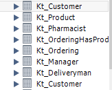

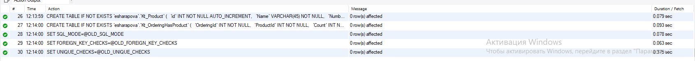

# База Данных в MySQL

### Таблица Product:

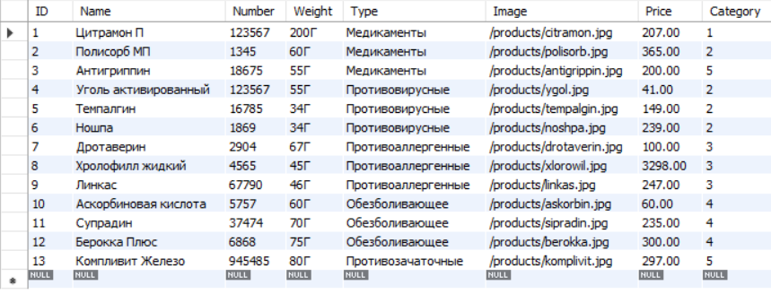

### Структура таблицы Product:
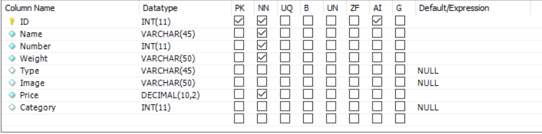

### Таблица Order:

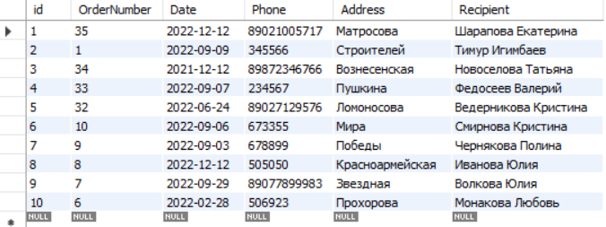

### Структура таблицы Order:

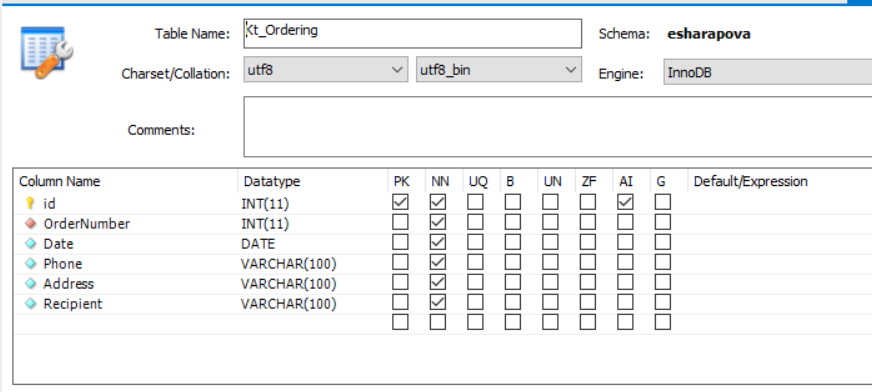

### Таблица OrderProduct:

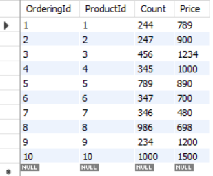

### Структура таблицы OrderProduct:

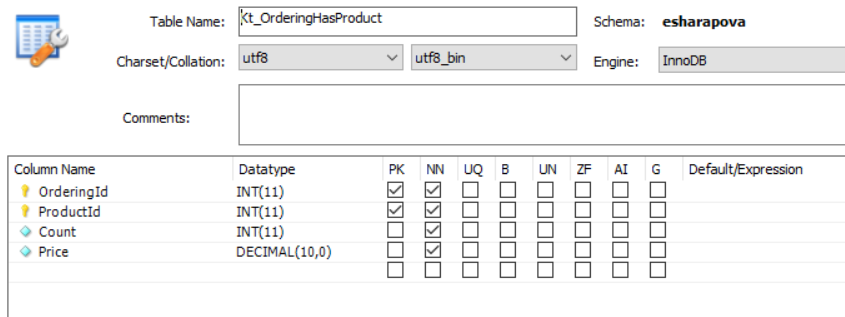

# Проект на С#

Проект на C# выполнен с помощью технологии WPF, приложение для администрирование базы данных

### Функциональность приложения:

•поиск

•добавление

•редактирование

•удаление

•сортировка

•фильтрация

### Реализация приложения

1. Первым делом я создала модель продуктов:

```
public class Product
    {
        public int ID { get; set; }
        public string Name { get; set; }
        public int Number { get; set; }
        public string Weight { get; set; }
        public string Image { get; set; }
        public decimal Price { get; set; }
     
        public ProductType CurrentProductType { get; set; }

        public Uri ImagePreview
        {
            get
            {
                var imageName = Environment.CurrentDirectory + (Image ?? "");
                return System.IO.File.Exists(imageName) ? new Uri(imageName) : null;
            }
        }
    }
        
```

2. Далее в интерфейсе IDataProvider создала метод для получения продуктов из базы данных:

```
public interface IDataProvider

    {
        IEnumerable<Product> GetProduct();
    
```
3. В классе MySqlDataProvider реализовала метод получения продуктов:

```
 public IEnumerable<Product> GetProduct()
        {
            GetProductTypes();
            List<Product> Listproducts = new List<Product>();
            string Sql = @"SELECT 
                      p.*,
                    pt.`Title`
                    FROM Kt_Product p
                    LEFT JOIN 
                    Kt_ProductType pt ON p.Category = pt.ID";
            try
            {

                Connection.Open();
                try
                {
                    MySqlCommand Command = new MySqlCommand(Sql, Connection);
                    MySqlDataReader Reader = Command.ExecuteReader();
                    while (Reader.Read())
                    {
                        Product NewProduct = new Product();
                        NewProduct.ID = Reader.GetInt32("ID");
                        NewProduct.Name = Reader.GetString("Name");
                        NewProduct.Number = Reader.GetInt32("Number");
                        NewProduct.Weight = Reader.GetString("Weight");

                        NewProduct.Image = Reader["Image"].ToString();
                        NewProduct.Price = Reader.GetDecimal("Price");
                        //  NewProduct.Category = Reader.GetInt32("Category");
                        NewProduct.CurrentProductType = GetProductType(Reader.GetInt32("Category"));
                        //  NewProduct.CurrentProductType = GetProductType(Reader.GetInt32("ProductTypeID"));
                        Listproducts.Add(NewProduct);
                    }
                }
                finally
                {
                    Connection.Close();
                }
            }
            catch (Exception ex)
            {
                MessageBox.Show(ex.Message);
            }
            return Listproducts;
        }
```
4. Далее создала класс Globals, чтобы получать методы с интерфейса влюбом месте кода:

```
public class Globals
    {
      public  static IDataProvider dataProvider;

    }
```
5. Далее в главном окне получила продукты в созданный лист продуктов:

```
public IEnumerable<Product> ProductList
        {
            get
            {
                var Result = _ProductList;
               

                if (ProductTypeFilterId > 0)
                    Result = Result.Where(p => p.CurrentProductType.ID == ProductTypeFilterId);

                switch (SortType)
                {
                    // сортировка по названию продукции
                    case 1:
                        Result = Result.OrderByDescending(p => p.Name);
                        break;
                    case 2:
                        Result = Result.OrderBy(p => p.Name);
                        break;
                    case 3:
                        Result = Result.OrderByDescending(p => p.Number);
                        break;
                    case 4:
                        Result = Result.OrderBy(p => p.Number);
                        break;
                    case 5:
                        Result = Result.OrderByDescending(p => p.Price);
                        break;
                    case 6:
                        Result = Result.OrderBy(p => p.Price);
                        break;


                }
                if (Poisk != "")
                    Result = Result.Where(p => p.Name.IndexOf(Poisk, StringComparison.OrdinalIgnoreCase) >= 0);

                return Result;
            }
            set
            {
                _ProductList = value;
                Invalidate();
            }
        }
```
6. В конструкторе главного окна получила метод получения продуктов:

```
 public MainWindow()
        {
            InitializeComponent();
            DataContext = this;
            Globals.dataProvider = new MySqlDataProvider();
            ProductList = Globals.dataProvider.GetProduct();
            ProductTypeList = Globals.dataProvider.GetProductTypes().ToList();
            ProductTypeList.Insert(0, new ProductType { Title = "Все типы" });
        }
```

7. Далее написала верстку главного окна, за основу был взят ListView

```
<Window x:Class="KatyaRyrs.MainWindow"
        xmlns="http://schemas.microsoft.com/winfx/2006/xaml/presentation"
        xmlns:x="http://schemas.microsoft.com/winfx/2006/xaml"
        xmlns:d="http://schemas.microsoft.com/expression/blend/2008"
        xmlns:mc="http://schemas.openxmlformats.org/markup-compatibility/2006"
        xmlns:local="clr-namespace:KatyaRyrs"
        mc:Ignorable="d"
        Title="MainWindow" Height="450" Width="900">
    <Grid>
        <Grid.RowDefinitions>
            <RowDefinition Height="auto"/>
            <RowDefinition Height="*"/>
        </Grid.RowDefinitions>
        
        <ListView
            MouseDoubleClick="ProductListView_MouseDoubleClick"
            ScrollViewer.HorizontalScrollBarVisibility="Disabled"
            Grid.Row="1"
            x:Name="ProductListView"
            HorizontalAlignment="Center"
            ItemsSource="{Binding ProductList}">
            <ListView.ItemsPanel>
                <ItemsPanelTemplate>
                    <WrapPanel
                        Orientation="Horizontal"
                        HorizontalAlignment="Center"
                        />
                </ItemsPanelTemplate>
                
            </ListView.ItemsPanel>
            
            <ListView.ItemTemplate>
                <DataTemplate>


                    <Grid Margin="20" Width="310">

                        <Grid.RowDefinitions>
                            <RowDefinition Height="200"></RowDefinition>
                            <RowDefinition Height="5"></RowDefinition>
                            <RowDefinition Height="auto"></RowDefinition>
                            <RowDefinition Height="auto"></RowDefinition>
                        </Grid.RowDefinitions>


                        <Image
    Width="170" 
    Height="170"
                           HorizontalAlignment="Right"
    Source="{Binding ImagePreview}" />
                            <StackPanel
                            Grid.Column="1"
                            Margin="5"
                            Orientation="Vertical">
                                <TextBlock
                                    Grid.Row="0"
                                    FontSize="14"
                                    VerticalAlignment="Center"
                                    TextAlignment="Center"
                                    Width="300"
                                    TextWrapping="Wrap"
                                    HorizontalAlignment="Left"
                                    Margin="5 5"
                                    FontWeight="Black"
                                    x:Name="NameBlock"
                                    Text="{Binding Name}"/>
                                <TextBlock
                                    Grid.Row="1" 
                                    FontSize="12"
                                    HorizontalAlignment="Left"
                                    Text="{Binding Number}"/>
                                <TextBlock
                                    Grid.Row="2"
                                    FontSize="12"
                                    HorizontalAlignment="Left"
                                    Text="{Binding Weight}"/>
                                <TextBlock
                                    Grid.Row="3"
                                    FontSize="12"
                                    HorizontalAlignment="Left"
                                    Text="{Binding CurrentProductType.Title}"/>
                          
                                <TextBlock
                                    Grid.Row="4"
                                   HorizontalAlignment="Left"
                                    FontSize="14"
                                     Width="300"
                                    FontWeight="Bold"
                                    Text="{Binding Price, StringFormat={}{0:N2} РУБ}"/>
                                <Button
                                    HorizontalAlignment="Left"
                Content="Удалить"
                          Tag="{Binding ID}"
                x:Name="DeletButton"
                Click="DeletButton_Click"
                Margin="5"
                Width="60"
                Height="20"
                />
                            </StackPanel>
                        </Grid>

                   
                </DataTemplate>
            </ListView.ItemTemplate>
        </ListView>

        <WrapPanel
            Orientation="Horizontal"
        ItemHeight="50"
         >
            <Label
                Content="Поиск"
                x:Name="Search"
                VerticalAlignment="Center"/>
            <TextBox
                x:Name="PoiskTextBox"
                Width="150"
                VerticalAlignment="Center"
                KeyUp="PoiskTextBox_KeyUp"/>
            <Label 
                x:Name="Sortirovka"
        Content="Сортировка: "
        Margin="10,0,0,0"
        VerticalAlignment="Center"/>
            <ComboBox
                
        x:Name="SortTypeComboBox"
        SelectedIndex="0"
        VerticalContentAlignment="Center"
        MinWidth="100"
        SelectionChanged="SortTypeComboBox_SelectionChanged"
        ItemsSource="{Binding SortList}"/>
            <Label Content="Тип продукции" VerticalAlignment="Center"/>
            <ComboBox
    Width="150"
    x:Name="ProductTypeFilter"
    VerticalAlignment="Center"
    SelectedIndex="0"
    SelectionChanged="ProductTypeFilter_SelectionChanged"
    ItemsSource="{Binding ProductTypeList}">
            </ComboBox>
            <Button
             x:Name="AddproductsButton"
               Margin="20,0,0,0"
                Click="AddproductsButton_Click"
                Content="Добавить продукт"/>

        </WrapPanel>
    </Grid>
</Window>
```
8. Результат: 
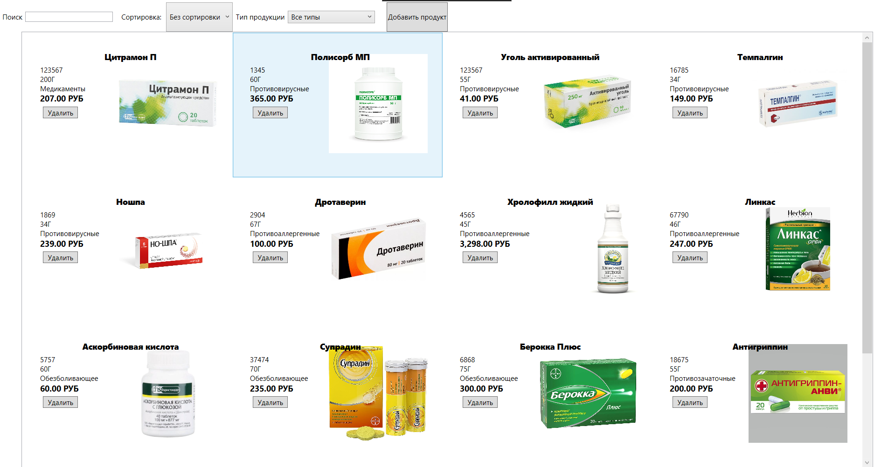

9. Создание поиска:

Верстка:
```
<Label
                Content="Поиск"
                x:Name="Search"
                VerticalAlignment="Center"/>
            <TextBox
                x:Name="PoiskTextBox"
                Width="150"
                VerticalAlignment="Center"
                KeyUp="PoiskTextBox_KeyUp"/>
```
Реализация в коде:
```
private string Poisk = "";
      

        private void PoiskTextBox_KeyUp(object sender, KeyEventArgs e)
        {
            Poisk = PoiskTextBox.Text;
            Invalidate();
        }
```
10. Создание сортировки:

Верстка:
```
<Label 
                x:Name="Sortirovka"
        Content="Сортировка: "
        Margin="10,0,0,0"
        VerticalAlignment="Center"/>
            <ComboBox
                
        x:Name="SortTypeComboBox"
        SelectedIndex="0"
        VerticalContentAlignment="Center"
        MinWidth="100"
        SelectionChanged="SortTypeComboBox_SelectionChanged"
        ItemsSource="{Binding SortList}"/>
```
Реализация в коде:

```
private void SortTypeComboBox_SelectionChanged(object sender, SelectionChangedEventArgs e)
        {
            SortType = SortTypeComboBox.SelectedIndex;
            Invalidate();
        }
        public string[] SortList { get; set; } = {
            "Без сортировки",
            "название по убыванию",
            "название по возрастанию",
            "номер продукта по убыванию",
            "номер продукта по возрастанию",
            "цена по убыванию",
            "цена по возрастанию" };
```
11. Создание фильтра по типу продукции:

Верстка:
```
<Label Content="Тип продукции" VerticalAlignment="Center"/>
            <ComboBox
    Width="150"
    x:Name="ProductTypeFilter"
    VerticalAlignment="Center"
    SelectedIndex="0"
    SelectionChanged="ProductTypeFilter_SelectionChanged"
    ItemsSource="{Binding ProductTypeList}">
            </ComboBox>
```
Реализация в коде:

```
private int ProductTypeFilterId = 0;
        private void ProductTypeFilter_SelectionChanged(object sender, SelectionChangedEventArgs e)
        {
            ProductTypeFilterId = (ProductTypeFilter.SelectedItem as ProductType).ID;
            Invalidate();
        }
```
12. Создание добавления продукта:

Чтобы добавить продукт,нужно реализовать метод сохранения нового продукта, реализовываем всё также в классе,который наследует интерфейс(MySqlDataprovider):

```
public void SaveProduct(Product ChangedProduct)
        {
            Connection.Open();
            try
            {
                if (ChangedProduct.ID == 0)
                {
                    string Query = @"INSERT INTO Kt_Product
                    (Name,
                    Number,
                    Weight,
                    Image,
                    Price,
                    Category)
                    VALUES
                    (@Name,
                    @Number,
                    @Weight,
                    @Image,
                    @Price,
                    @Category)";

                    MySqlCommand Command = new MySqlCommand(Query, Connection);
                    Command.Parameters.AddWithValue("@Name", ChangedProduct.Name);
                    Command.Parameters.AddWithValue("@Number", ChangedProduct.Number);
                    Command.Parameters.AddWithValue("@Weight", ChangedProduct.Weight);
                    Command.Parameters.AddWithValue("@Image", ChangedProduct.Image);
                    Command.Parameters.AddWithValue("@Price", ChangedProduct.Price);
                    Command.Parameters.AddWithValue("@Category", ChangedProduct.CurrentProductType.ID);
                    Command.ExecuteNonQuery();
                }
                else
                {
                    string Query = @"UPDATE Kt_Product
                    SET
                    Name = @Name,
                    Number = @Number,
                    Weight = @Weight,
                    Image = @Image,
                    Price = @Price,
                    Category = @Category
                        
                    WHERE ID = @ID";

                    MySqlCommand Command = new MySqlCommand(Query, Connection);
                    Command.Parameters.AddWithValue("@Name", ChangedProduct.Name);
                    Command.Parameters.AddWithValue("@Number", ChangedProduct.Number);
                    Command.Parameters.AddWithValue("@Weight", ChangedProduct.Weight);
                    Command.Parameters.AddWithValue("@Image", ChangedProduct.Image);
                    Command.Parameters.AddWithValue("@Price", ChangedProduct.Price);
                    Command.Parameters.AddWithValue("@Category", ChangedProduct.CurrentProductType.ID);
                    Command.Parameters.AddWithValue("@ID", ChangedProduct.ID);
                    Command.ExecuteNonQuery();
                }
            }
            finally
            {
                Connection.Close();
            }
        }
```
Создаём окно, в котором будем создавать продукт:

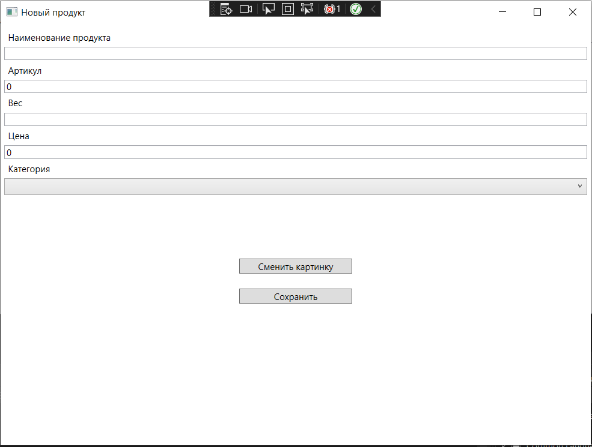

Переход на это окно будет при нажатии кнопки в главном окне:

```
private void AddproductsButton_Click(object sender, RoutedEventArgs e)
        {
            var NewEditWindow = new EditWindow(new Product());
            if ((bool)NewEditWindow.ShowDialog())
            {
                ProductList = Globals.dataProvider.GetProduct();
            }
        }
```

Реализуем в этом окне кнопку сохранения продукта:

```
 private void SaveButton_Click(object sender, RoutedEventArgs e)
        {
            try
            {
                Globals.dataProvider.SaveProduct(CurrentProduct);
                DialogResult = true;
                Invalidate();
            }
            catch (Exception ex)
            {
                MessageBox.Show(ex.Message);
            }
        }
```

13. Редактирование продукта:

Для редактирования продукта будем использовать то же самое окно что и для создания, оно будет открываться при двойном нажатии на продукт в главном окне, для этого в ListView пишем свойство:

```
MouseDoubleClick="ProductListView_MouseDoubleClick"
```

Реализация метода двойного клика по продукту:

```
private void ProductListView_MouseDoubleClick(object sender, MouseButtonEventArgs e)
        {
            var NewEditWindow = new EditWindow(ProductListView.SelectedItem as Product);
            if ((bool)NewEditWindow.ShowDialog())
            {
                // при успешном сохранении продукта перечитываем список продукции
                ProductList = Globals.dataProvider.GetProduct();
            }
        }
```
14. Кнопка удаления:

Поместим кнопку на каждый продукт в вёрстке( в StackPanel):

```
 <Button
 HorizontalAlignment="Left"
 Content="Удалить"
  Tag="{Binding ID}"
 x:Name="DeletButton"
 Click="DeletButton_Click"
 Margin="5"
 Width="60"
 Height="20"
  />  
```

Реализация метода удаления:

```
public void DeleteProduct(Product DelProduct)
        {
            try
            {
                Connection.Open();
                try
                {
                    string Query = "DELETE FROM Kt_Product WHERE ID = @ID";
                    MySqlCommand command = new MySqlCommand(Query, Connection);
                    command.Parameters.AddWithValue("@ID", DelProduct.ID);
                    command.ExecuteNonQuery();
                }
                finally
                {
                    Connection.Close();
                }
            }
            catch (Exception ex)
            {
                MessageBox.Show(ex.Message);
            }
        }
```

Далее вызвать этот метод при нажатии на кнопку удаления:

```
private void DeletButton_Click(object sender, RoutedEventArgs e)
        {
            var id = Convert.ToInt32((sender as Button).Tag.ToString());
            foreach (var DelProduct in ProductList)
            {
                if (DelProduct.ID == id)
                {
                    Globals.dataProvider.DeleteProduct(DelProduct);
                    ProductList = Globals.dataProvider.GetProduct();
                    break;

                }
            }
        }
```

15. Тестирование:

```
[TestClass]
    public class UnitTest1
    {
        [ClassInitialize]
        static public void Init(TestContext tc)
        {
            Globals.dataProvider = new FakeDataProvider();
        }

        [TestMethod]
        public void Save_AddProductWithoutName_Error()
        {
            Product ProductTest = new Product()
            {
                Name = ""
            };
            try
            {
                ProductTest.Save();
                Assert.Fail();
            }
            catch 
            { 

            }
            
        }
        [TestMethod]
        public void Save_AddCurrentProductTypeNotFilled_Error()
        {
            Product CurrentProductTypeTest = new Product()
            {
                CurrentProductType = null
            };
            try
            {
                CurrentProductTypeTest.Save();
                Assert.Fail();
            }
            catch
            {

            }
        }
        [TestMethod]
        public void Save_AddPriceLassAndNotNull_Error()
        {
            Product PriceTest = new Product()
            {
                Price = 0
            };
            try
            {
                PriceTest.Save();
                Assert.Fail();
            }
            catch
            {

            }

        }
        [TestMethod]
        public void Save_AddWeightProductNotFilled_Error()
        {
            Product WeightTest = new Product()
            {
                Weight = ""
            };
            try
            {
                WeightTest.Save();
                Assert.Fail();
            }
            catch
            {

            }
        }
        [TestMethod]
        public void Save_AddNumberProductLassAndNotNull_Error()
        {
            Product NumberTest = new Product()
            {
                Number = 0
            };
            try
            {
                NumberTest.Save();
                Assert.Fail();
            }
            catch
            {

            }
        }
        [TestMethod]
        public void Delete_DeleteNotProduct_Error()
        {
            Product IDTest = new Product()
            {
                ID = 0
            };
            try
            {
                IDTest.Delete();
                Assert.Fail();
            }
            catch
            {

            }
        }


    }
```

Результат выполнения всех методов тестирования:

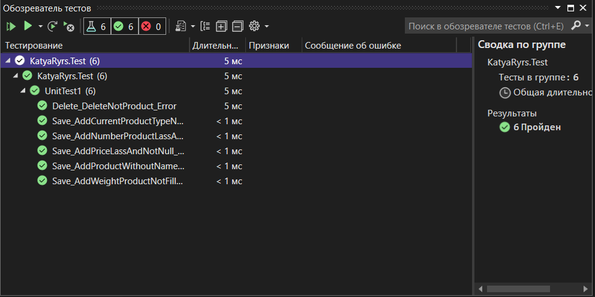

### Проект для администрирования базы данных на языке программирования C# был завершён.

# Вывод

Я разработала приложение для администрирования базы данных на языке C#. Данные, которые использовались в приложении, были сформированы в базе данных MySql с помощью импорта из трёх разных типов файлов(CSV, TXT, XLS). 
